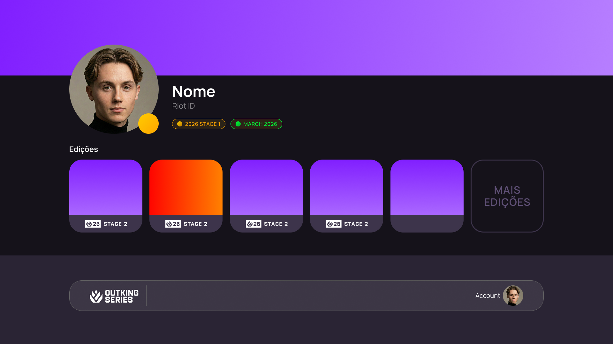

# OutKing Series - Stage 1

## Main requirements

This list provides us with the NEEDED functionality for the first stage of this website:

- Auth via Discord.
- User/player profile.
  - to be a player profile, it must first be approved by the admins/moderators and placed in a Team.
  - A regular user may browse and check tournament information as well as register to be a player (link to the discord server).
  - Non logged in users may browse and check tournament information, but they must create an account to attempt registering as a player.
- Team pages where users can check stats of each registered player.
- Admin panel where Tournament events can be created and managed:
  - An Admin/moderator can: add tournaments, teams and set profiles as players.
  - An Admin can: remove (not delete) tournaments and teams with confirmation.
    - A removal only makes it not visible to regular users/players.
- A badge system for profile, linked to Discord (synced roles with the OutKing Series server)
- Use Valorant's API for automatic tracking of a player's information and games by their riot id.

## Secondary Requirements

- Discord is SoT (source of truth): if a user logged in via Discord, we'll use their guild roles (in OutKing Series server)
- SSR (prevents manipulation of roles and access)
- We can use Riot Games' own promotional material (we have the license)
- Main page looks something like 
- Player view page looks something like 
